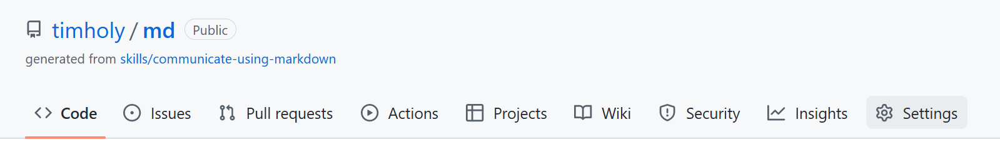
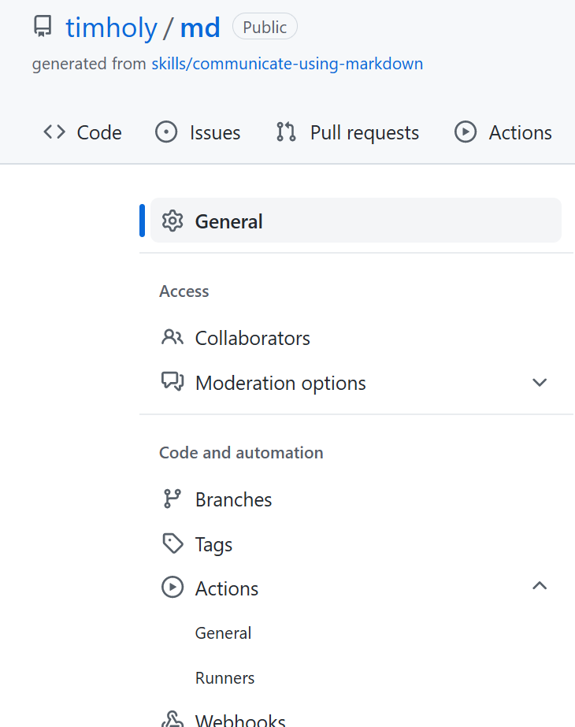
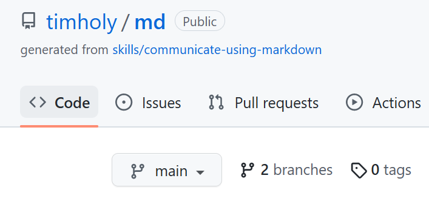
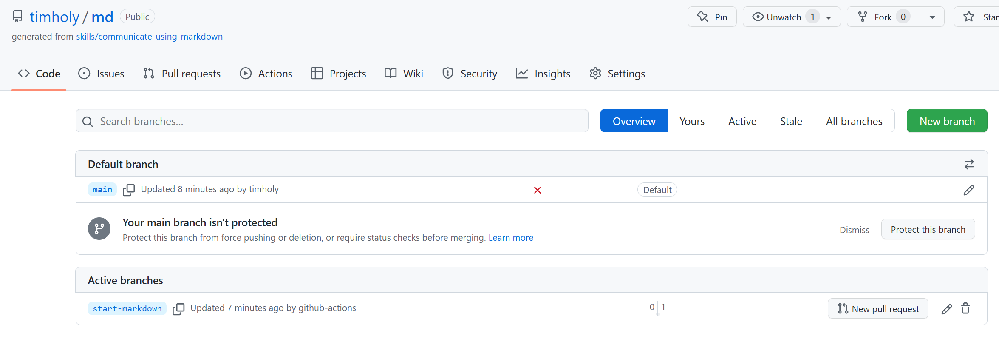
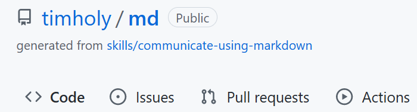
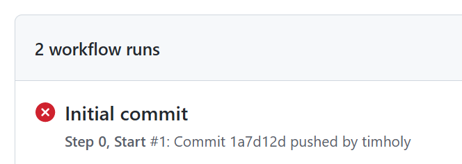
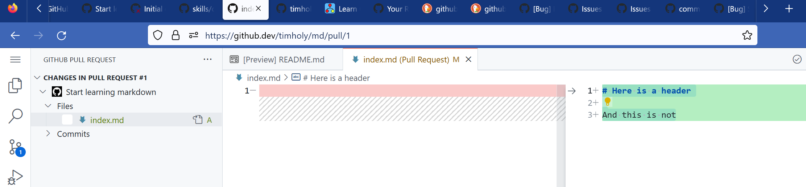
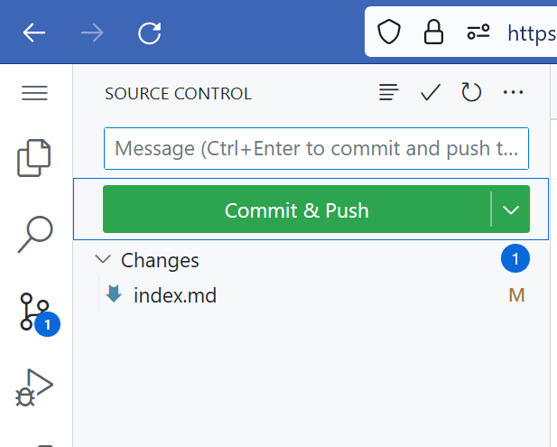
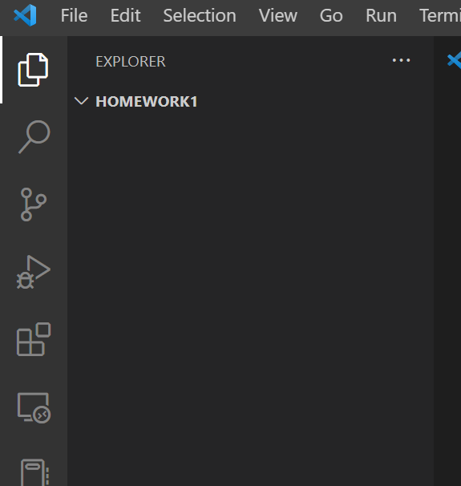
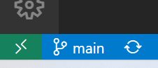

# Sources for learning

*Optional*: the [Open source initiative](https://opensource.org/licenses) is an approachable set of resources for questions about licenses commonly used in open-source projects.

*Optional*: `git` is sophisticated and can be daunting. An excellent (but long) resource is [The Git Book](https://git-scm.com/book/en/v2).
The most commonly-needed chapters are 1-3 and 6-8. There are also many online tutorials; one from [atlassian](https://www.atlassian.com/git) is widely appreciated. GitHub's [tutorials](https://github.com/git-guides/) are also good.
Finally, you can find a selection of videos on YouTube just by searching for `git`.
Many of these seem excellent, and there are so many good ones that I won't pick out any `git`-specific videos in particular.
A good broader perspective is [Complete Guide to Open Source - How to Contribute](https://www.youtube.com/watch?v=yzeVMecydCE),
which covers git & GitHub but many other topics besides (corresponding [GitHub repo here](https://github.com/freeCodeCamp/how-to-contribute-to-open-source)).

You will find that different tutorials will train you in different tools; some focus on the command line, others use one of several graphical clients. The command line is certainly the most ubiquitous, and if you become a serious developer `git`'s command line interface is a must-know.
However, in this nanocourse, many of you will probably be able to get by using the git support built into VS Code.
If you really get into trouble, the command-line or a more sophisticated graphical client is always there for you.

# Homework

There are 3 parts to this homework:

- initial setup: creating your GitHub account and installing and configuring `git`
- completing "GitHub Skills" modules
- completing VS Code-GitHub exercises

## Initial setup

### Set up a GitHub account (one-time setup)

Visit [GitHub](https://github.com/) and, if you don't already have an account, create one.
At a minimum, notify your instructor and your partner of your account name (and there is no harm sharing it with the whole class).
[2FA](https://authy.com/what-is-2fa/) is highly recommended but probably not required for this course, so setting it up is optional.
(Membership in many of Julia's GitHub organizations requires 2FA to be activated, so if you become an active contributor and get invited to join such an organization, it will become essential.)

Eventually, you might find it convenient to take additional configuration steps, like adding an [SSH key](https://docs.github.com/en/authentication/connecting-to-github-with-ssh). (Having an SSH key can mean fewer times you need to enter your password.) But that's not necessary for this class, and unless you're completely undaunted by steps like these it's best to wait until you need/want to.

If you get stuck, see [GitHub's documentation](https://docs.github.com/en/get-started/onboarding/getting-started-with-your-github-account
).

### Install & configure git (one-time setup)

Particularly if you're on Mac or Linux, you may already have `git`; try typing `git version` in a terminal and see if it responds with a version number.
If you need to install git, [these instructions](https://github.com/git-guides/install-git) may be helpful.

Once `git` is installed, you likely need to do a one-time configuration: from your terminal (or the Git Bash terminal), enter
your credentials as shown below, replacing "John Doe" with your name and similarly for other settings.

```sh
git config --global user.name "John Doe"
git config --global user.email johndoe@example.com
git config --global github.user johndoe12345
```

If `git` does things that annoy you (e.g., open up a strange editor you don't understand), see [more configuration options](https://www.git-scm.com/book/en/v2/Getting-Started-First-Time-Git-Setup) or [the complete details](https://www.git-scm.com/book/en/v2/Customizing-Git-Git-Configuration). Collaborations between Windows and non-Windows users may wish to ensure that the `core.autocrlf` option is set as described in the latter page.

### Install & configure vscode

*These instructions are copied from `setup.md`*

Visual Studio Code (VS Code) is a modern, cross-platform, cross-language development environment. It is not required (you can use whatever editor you like), but it is recommended, and many assignments will give VS Code-specific instructions which you may have to perform by other means if you use a different editor.

Install [VS Code from here](https://code.visualstudio.com/).

To install the [extensions](https://code.visualstudio.com/docs/editor/extension-marketplace):

- launch VS Code

- click on the extension manager (in the vertical bar at the left):
  

- type `GitHub` in the search bar and install the "GitHub Pull Requests and Issues" extension

- type `git` in the search bar and install the "Git History" extension

Other useful extensions include `Jupyter` (for editing Jupyter notebooks) and the [remote-development extensions](https://code.visualstudio.com/docs/remote/remote-overview) (if you ever want to edit code on a different machine remotely).

If you are not already familiar with VS Code, you should spend some time reading the documentation (see the "Docs" in the banner at the top of the VS Code page), particularly the [user interface](https://code.visualstudio.com/docs/getstarted/userinterface).  If you prefer [videos](https://code.visualstudio.com/docs/getstarted/introvideos), the first two ("Getting Started" and "Code Editing") would be the minimum needed to start.


Visual Studio Code (VS Code) is the recommended editor & development environment for this course. You are welcome to use other tools if you prefer, but all instructions will be presented for VS Code.

Visit the [VS Code installation page](https://code.visualstudio.com/) and download the current version for your platform. If you're unfamiliar with it, there were links to the documentation above in [Sources for learning].

## Complete "GitHub Skills" modules

You can get started with GitHub with nothing more than your browser.
On the [GitHub Skills](https://skills.github.com/) page, complete the following modules:

1. Introduction to GitHub
2. Communicate using Markdown
3. Review pull requests
4. Resolve merge conflicts

Starting with "Communicate using Markdown," you may encounter **a significant snafu that you'll need to fix manually**: you may not receive the promised pull request (PR). If this happens to you, fix it as follows:

1. After clicking "Use this template" → "Create a new repository" and completing the creation process (through clicking "Create repository from template"), you'll see your repository. Go to `Settings`:

    

    and then click `Actions` → `General`:

    

    Scroll down to the bottom and click "Allow GitHub Actions to create and approve pull requests" and click "Save."
2. Go back to the main screen by clicking the name of the repository in the top left. Click `branches`:

    

    and then click the "trash can" icon to the right of the new branch:

    

    In this case, the "start markdown" branch.
3. Go back to the main screen and click the `Actions tab`:

    

    Click on the failing action titled "Initial commit":

    

    In the upper right, click "Re-run jobs" → "Re-run failed jobs". Approve the re-run and wait for the spinning yellow circle to turn green (yay) or red (boo). Annoyingly, for me it turned red, but this second failure does not seem to be anything major.

But the hassle doesn't end here: a step or two later I got an "Error: Looks like something went wrong" when trying to [edit the file](https://github.com/skills/communicate-using-markdown/issues/36). (Sheesh, GitHub!) The way I fixed this was:
1. Open the pull request as instructed ("Pull requests" → "Start learning markdown"), but then instead of going to the "Files changed" tab, I hit `.` on my keyboard. *This opens a web-browser version of VS Code* and is worth knowing about.
2. Note (see lower left) that you're already on the `start-markdown` branch (because you opened it from the PR)
3. In the edit pane, add some text to the file, e.g.,

    ```
    # Here is a header

    And this is not
    ```

  You must enter this in the right side of the split panes:

  

4. Click the `git` icon:

    

   then hover over `index.md`, click on the `+` to "Stage changes."
5. Enter a commit message. I used "Add a header"
6. Click "Commit and push"
7. Under the hamburger menu, click "Go to repository"

Now you should be able to complete the remainder of the exercises as instructed.


## Working with `git` locally

Much of the time you'll want to edit code on your local machine and use GitHub for sharing code. Consequently, it's important to learn how to interact with `git` and GitHub from your local machine.

When creating Julia packages, there's a lovely tool called `PkgTemplates` that we'll learn about during the third lecture. Here we'll just create a simple local text-only repository.

### Create a repository on your computer via VS Code

1. Open a new VS Code window
2. Click "File" → "Open folder". Use your file browser to create an empty folder wherever you like to keep class work or source code.  For example, on Windows I entered "Homework1" as the folder name, selected that folder, and then clicked "Select Folder".
3. VS Code should show you an empty folder. Click the `git` icon

    

   (along the left, see the one that is highlighted in white while all others are gray). Click "Initialize repository."
4. Click the "Files & folders" icon

    

    and then click the "New File..." icon along the top of the explorer. Name the file "README.md".
5. In the main editor window, add some content to "README.md". Here's what I added:
    ```
    # My first local repository

    I created this on my local machine using VS Code.
    ```
    Note that this is Markdown, as covered in a "GitHub skills" module.
6. Go back to the `git` icon, which now should show 1 file with local changes. Next to `README.md` click the `+` to stage these changes. Enter `Add a README` as the commit message and click `Commit`.
7. Click `Publish Branch`. Select `Publish to GitHub public repository`. If it succeeds you should see a button that will open the repository in your browser. Congrats, you've made a local commit and pushed it up to GitHub!
8. Next, you'll see how to incorporate the latest updates, which we imagine might be from a pull request submitted by someone else. To simulate this, let's add a commit *on GitHub*: in your browser, click on the `README.md` file, click the pencil icon to edit it, and add a line like
   ```
   But I added this line using my browser on GitHub.
   ```
   Click `Commit changes...`, add a commit message (I used `Add a note about remote development`), and click `Commit changes` (you can commit directly to the `main` branch).
9. Switch back to VS Code. Note that the contents of `README.md` are behind the contents on GitHub. We'll "pull" the changes: click the "Synchronize changes" button:

  

  in the lower left and you should see the contents come up to date.
10. Send the URL for this repository to the instructor for grading.
