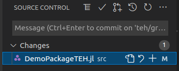

# Sources for learning

*Optional*: the [Open source initiative](https://opensource.org/licenses) is an approachable set of resources for questions about licenses commonly used in open-source projects.

*Optional*: `git` is sophisticated and can be daunting. An excellent (but long) resource is [The Git Book](https://git-scm.com/book/en/v2).
The most commonly-needed chapters are 1-3 and 6-8. There are also many online tutorials; one from [atlassian](https://www.atlassian.com/git) is widely appreciated. GitHub's [tutorials](https://github.com/git-guides/) are also good.
Finally, you can find a selection of videos on YouTube just by searching for `git`.
Many of these seem excellent, and there are so many good ones that I won't pick out any `git`-specific videos in particular.
A good broader perspective is [Complete Guide to Open Source - How to Contribute](https://www.youtube.com/watch?v=yzeVMecydCE),
which covers git & GitHub but many other topics besides (corresponding [GitHub repo here](https://github.com/freeCodeCamp/how-to-contribute-to-open-source).

You will find that different tutorials will train you in different tools; some focus on the command line, others use one of several graphical clients. The command line is certainly the most ubiquitous, and if you become a serious developer `git`'s command line interface is a must-know.
However, in this nanocourse, many of you will probably be able to get by using the git support built into VS Code.
If you really get into trouble, the command-line or a more sophisticated graphical client is always there for you.

*Required*: Julia packages are best started and cloned from within Julia itself.
Remember that the Pkg.jl documentation (see the previous session) is good for general package-management questions,
including when you want to contribute to an existing package.
When starting your own package, the [PkgTemplates README](https://github.com/invenia/PkgTemplates.jl) and [documentation](https://invenia.github.io/PkgTemplates.jl/stable/user/) are thorough guides to your options.

# Homework

There are 3 parts to this homework:

- initial setup: creating your GitHub account and installing and configuring `git`
- creating, improving, and collaborating in "demo" repositories
- becoming a Julia package developer by making a real-world contribution

## Initial setup

### Set up a GitHub account (one-time setup)

Visit [GitHub](https://github.com/) and, if you don't already have an account, create one.
At a minimum, notify your instructor and your partner of your account name (and there is no harm sharing it with the whole class).
[2FA](https://authy.com/what-is-2fa/) is highly recommended but probably not required for this course, so setting it up is optional.
(Membership in many of Julia's GitHub organizations requires 2FA to be activated, so if you become an active contributor and get invited to join such an organization, it will become essential.)

Eventually, you might find it convenient to take additional configuration steps, like adding an [SSH key](https://docs.github.com/en/authentication/connecting-to-github-with-ssh). (Having an SSH key can mean fewer times you need to enter your password.) But that's not necessary for this class, and unless you're completely undaunted by steps like these it's best to wait until you need/want to.

If you get stuck, see [GitHub's documentation](https://docs.github.com/en/get-started/onboarding/getting-started-with-your-github-account
).

### Install & configure git (one-time setup)

Particularly if you're on Mac or Linux, you may already have `git`; try typing `git version` in a terminal and see if it responds with a version number.
If you need to install git, [these instructions](https://github.com/git-guides/install-git) may be helpful.

Once `git` is installed, you likely need to do a one-time configuration: from your terminal (or the Git Bash terminal), enter
your credentials as shown below, replacing "John Doe" with your name and similarly for other settings.

```sh
git config --global user.name "John Doe"
git config --global user.email johndoe@example.com
git config --global github.user johndoe12345
```

If `git` does things that annoy you (e.g., open up a strange editor you don't understand), see [more configuration options](https://www.git-scm.com/book/en/v2/Getting-Started-First-Time-Git-Setup) or [the complete details](https://www.git-scm.com/book/en/v2/Customizing-Git-Git-Configuration). Collaborations between Windows and non-Windows users may wish to ensure that the `core.autocrlf` option is set as described in the latter page.

## Practice with a demo package

You will be paired with a fellow classmate. You will create one repository, and you will contribute to your partner's repository (and your partner will contribute to yours). Your homework will be the record of your commits and interactions in these two repositories;
there is nothing more you need to turn in.

**Important**: you and your partner will both be contributing to each others' repositories, and as described in lecture this occurs by you "forking" a repository that you don't have permission to write to directly. That means you'll have both your own repository and a fork of your partner's repository under your own account. **GitHub does not allow you to have two repositories with the same name** in a single account. Consequently you and your partner have to make sure that your repositories have different names. I suggest using your initials---I am "Timothy E. Holy" so my package will be called `DemoPackageTEH.jl`.  But to avoid any potential for conflict (e.g., in case you happen to share the same initials), **be sure to agree on your choices with your partner**.

### Create a package on your computer

1. Start Julia, add `PkgTemplates` to your default environment if it's not already installed. (PkgTemplates is one of those packages that works well in your default environment.)

2. Type `using PkgTemplates`.

3. Read the help on `Template` and then create one:

   ```julia
   tpl = Template(; plugins=[GitHubActions(), Codecov(), Documenter{GitHubActions}()])
   ```

    You can use this format for all packages you create in the course. We won't get to the meaning of all of those options until the next two sessions, but you might as well establish good habits now.

4. Create the package: `tpl("DemoPackageTEH")` (throughout, use whatever name you agreed on with your partner). If all goes well, you should see a message that ends like

    ```julia
    [ Info: New package is at /home/tim/.julia/dev/DemoPackageTEH
    ```

   It's worth noting or remembering this location, since that's where you'll need to edit the package.

### Set up a corresponding blank repository on GitHub

Log in to your GitHub account (if you aren't already), and near the upper right you should see a `+`. Click it and select "New repository."
Leave it on "No template" (PkgTemplates has done all that for us), enter `DemoPackageTEH.jl` for the package name (**note the additional `.jl` ending, a convention that makes Julia packages more searchable**), select `Public`, and then click `Create repository`.
A new page will appear; leave this open (in case of trouble), but don't take those steps yet (or at all, as you should be able to do everything from within VS Code).

If you get stuck, see [the GitHub docs](https://docs.github.com/en/get-started/quickstart/create-a-repo), keeping in mind that PkgTemplates has already created files (the README, `.gitignore`, and the LICENSE file). Do *not* create them on GitHub, or you'll get a conflict.

### Sync the package on your computer to GitHub

Start VS Code and open the folder of your new package. (Given the message above from when you created the package, that would be something like `/home/tim/.julia/dev/DemoPackageTEH`.)
At the lower left you should see the `git` icon and the name of your default branch, `main`:


\

Click the little "push up to cloud" icon to the right of "main"; it should push the template that PkgTemplates created for you up to GitHub. Re-open or refresh the web page for your package in a new tab, and you should see the default GitHub page showing a list of files and the content of the README.

Click on the `commits` link at the right of the bar across the top of the folder view:


\

(You probably only have 2 commits vs. the 3 you see in this screenshot; I made an extra one to clarify to anyone who stumbles across the package that this is just a dummy package.)

The list of commits should match what you see locally if you click on the `git`/Source control icon in VS Code:


\

and then the "clock" icon ("View History (git log)") across the top:


\

In the window that pops up, the red & green colorful badges over to the right tell you the current status of your local and remote repositories. Currently both badges should be next to each other on your most recent commit, but as you make commits locally the red "origin/main" (`origin` is your *remote*) badge will lag behind your "main" badge, indicating that GitHub is "behind" your local repository, until you synchronize the repositories (more on that later).

You can close the history-view window by clicking on its "x" in its tab. Now you are ready to start developing!

### Create a branch

You generally want to keep `main` synced with what's up on GitHub; most changes should be made on a branch.
Click on the `main` down at the lower left, and VS Code will invite you to supply a new branch name.
I usually name it with my initials and a brief summary of the intent of the change: for example, `teh/better_docs`
might be something I'd use if I'm improving the documentation. Here, I'm going to name the branch `teh/greeting`.
My status bar looks like this:


### Make your first change

Open the main (and currently only) `src` file, `src/DemoPackageTEH.jl`. Replace the comment with a one-line function definition,

```julia
print_greeting() = print("Hello, world!")
```

Open the Julia REPL within VS Code, type `using DemoPackageTEH`, and then check whether `DemoPackageTEH.print_greeting()` prints
the expected greeting.

**Note**: PkgTemplates does *not* add your new package to your default environment.
Despite that, if you did this within the VS Code session that you opened on the `DemoPackageTEH` folder, the above should have worked.
Why? In figure \ref{fig:greeting-branch}, you can see that the environment ("Julia env:") is set to `DemoPackageTEH`; by opening VS Code on your project folder, the Julia extension also set you up with the environment of the package. You can see what packages are in that environment by entering `pkg>` mode and typing `status`. (The answer: not much! Your new package does not yet depend on other packages.)
If you're ever not in the environment you intend, you can `activate` it from `pkg>` mode.

### Make your first "real" commit

Click on the "Source control" icon:


\

Note that the blue circle with a "1" in it means you have 1 modified file. You should see something like this:


\

Click on the file and examine the side-by-side *diff* showing your changes.
The left pane shows the old status, with deletions in red; the right side shows the new status, with additions in green.
Click on the `+` to *stage* your changes.
VS Code allows you to be choosy about which changes you stage even within a file (select a range of lines in the `diff` and then right-click to see some options), but we won't need such features here.
You can always undo a staging choice by clicking the `-` under "Staged changes".
Once you have staged the complete set of changes you want to commit, enter a *commit message* (I chose "Add greeting") and click the check.
Note that commit messages should have a short summary on the first line; you can follow that with a blank line and then provide more detail.
See [this example](https://tbaggery.com/2008/04/19/a-note-about-git-commit-messages.html) that describes common formatting conventions for commit messages. Sadly, at the time of this writing VS Code still doesn't support automatic word wrap, see [this issue](https://github.com/Microsoft/vscode/issues/2718).

Congratulations, you've made your first commit! You can see it in the history, where your new branch is 1 commit ahead of both your local `main` and GitHub's `origin/main`.

**You are strongly encouraged to watch `git` in action** by switching back and forth between `main` and your new branch: just click on the branch name in the status bar, select a different branch from the list that pops up, and you should see your local source code (magically!) change. This is the power of `git`: an entire folder's worth of source code can be drastically (but reversibly) modified with the click of a button, and you can run each version in Julia and compare them. (You may need to restart Julia to see the changes take effect unless you've installed the [Revise package](https://github.com/timholy/Revise.jl) and configured it to run automatically.) Be sure to go back to your new branch when you're done experimenting.

### Submit your change as a pull request (PR)

We'll use pull requests for all changes, even though this is your own repository.
By using a pull request even for your own changes, you help create a welcoming atmosphere for other contributors, who can review your changes either to know what's coming or who may even make suggestions about potential improvements.
There's no harm in pushing small changes directly to `main`, bypassing the ordinary process that facilitates interactive code review. However, using pull requests for most changes sends the message "I welcome contributors and will work with you on similar terms to how you work with me."

Between the check and the clock-like icon, there is the "Create pull request" icon; click that and then click "Publish branch".
Annoyingly, VS Code's git/GitHub extensions do not always seem to cooperate, and it sometimes chooses a bad "Title"; be sure to check it and edit it as needed.
If you need to elaborate on the purpose of a pull request, you can do so in the "Description" box.
Click "Create" when you are ready to submit.

VS Code should shortly open a new tab for the pull request. Near the top there should be a blue "#1" link (the 1 means this is pull request number 1); clicking it will take you to the GitHub page for your pull request. (This is a near-duplicate of what you see in VS Code itself.)

You may see (depending on timing) some yellow dots indicating that GitHub is testing your code. We haven't actually written any tests yet, so these should turn into green check marks pretty soon. Wait until that happens; when it does, merge your pull request to `main`.
Edit, if necessary, the message (not necessary in this case) and click "Confirm merge".
You can do this either with your browser or VS Code itself; it doesn't matter much, although at the time of this writing the browser offers a tad more functionality.
(There are actually several options for how you do the merge, but it doesn't really matter in this case, so pick any one of them.
You'll learn more later.)
You can delete that branch on GitHub and, if you did the merge with VS Code, locally.

### Re-synchronize your `main` branch to GitHub's

If you used your browser to do the merge, there's one more step to do: on your own machine, switch back to your `main` branch (by clicking on the branch name in the status bar at the lower left) and refresh it with the "recirculate" icon. It should pull in the changes you just merged from that pull request.
First, check that the source code on `main` now includes `print_greeting`. Second, you can check your `git` history, where you will see the branching pattern and indicators for all local and remote branches. If you want, you do some branch-cleaning by clicking on the `x` associated with the merged branch.

**Do not delete `main`!**

### Let your partner know you've made your first "real" commit

Send an email or whatever to your partner, letting xem know your repository is ready for contribution. When you receive the corresponding email about xir repository also being ready, the next two tasks can be done in either order. Don't go any farther until you're both ready.

### Task 1: make a PR to your partner's repository

GitHub lets you make simple changes using a [web interface](https://docs.github.com/en/repositories/working-with-files/managing-files/editing-files), and recently even bigger changes can be made by running [VS Code in your browser](https://github.com/features/codespaces). I sometimes use these approaches in my own contributions. However, most of the time I make the changes locally on my own machine; this gives you maximum flexibility, like making corresponding changes to other packages in the ecosystem that interact with the one you're modifying. To ensure you know how to do this,
make all changes locally using the approach described below; after this homework has been turned in, for future assignments you can use any approach you prefer.

If you get stuck, [GitHub's fork documentation](https://docs.github.com/en/get-started/quickstart/fork-a-repo) may be helpful, although know that Julia's `Pkg.develop` is recommended above manual cloning.

#### Step 1a: make a fork of your partner's repository

In the GitHub web interface, navigate to your partner's account and find xir `DemoPackage` repository (again, named slightly differently from yours, I'll call it `DemoPackageMP.jl` where MP = My Partner). Click the `Fork` button to make a copy in your own account. Remember, this is necessary because you don't have permission to submit changes to xir repository, and you need a web-hosted place to push your changes.

#### Step 1b: `dev` your partner's package locally

Back at the `julia> ` prompt, switch to your default environment by switching into package mode and using `activate`:

```julia
(DemoPackageTEH) pkg> activate
  Activating environment at `~/.julia/environments/v1.6/Project.toml`

(@v1.6) pkg>
```

We took this step so that the next statement makes your partner's package a dependency of your *default environment*, not of *your package*:

```julia
(@v1.6) pkg> dev https://github.com/timholy/DemoPackageMP.git
```

You get that URL from the `Code` dropdown on *your fork repository's* home page; you can copy/paste it into the Julia terminal to execute that `dev` command. You use your fork for this because you can `push` to your fork, but not to your partner's repository.

(When you are done with this assignment, you can `(@v1.6) pkg> rm DemoProjectMP`.)

---

**NOTE**

If you accidentally `dev` the *upstream* repository rather than your fork, you may have trouble pushing. No worries, this is fixable:

- fork the upstream repository to your own account, if you haven't already
- in VS Code's `git`/"Source control" view, click the "..." and select "Remote" and then "Add remote..."
- choose "Add remote from GitHub" and select the repository (in this case, your fork)
- give the remote a name; I usually choose "myfork"
- when you push branches, VS Code may prompt you to choose a remote. When you don't have permission to push to `origin`, push it to `myfork`.

---

#### Step 1c: modify the code in your partner's package

Open a new VS Code window and open the `DemoProjectMP` folder in your `.julia/dev` directory. Create a new branch for your change.
Then, open xir main source file (`DemoProjectMP.jl`), and change it so that it prints in color:

```julia
print_greeting() = printstyled("Hello, world!"; color=:cyan)
```

Check that this works using the VS Code REPL. Make a commit as before, and submit it as a pull request. *Reminder about key concepts: the change will be stored in your fork, and the pull request is from your fork to the original repository.*

At some point you will receive a similar pull request from your partner in your own package; **do not merge yet**, we'll walk through the review process first.

### Task 2: submit a 2nd PR to your own repository

After thinking about it for a while, you realize you've limited the flexibility of your `print_greeting` method: you should have allowed for an `io::IO` argument so that the output could be sent to a file as well as `stdout`. Let's fix this oversight!

Starting from your own `main` (for me in `DemoProjectTEH`, *not* `DemoProjectMP`), create another branch and add this new argument by modifying your code to:

```julia
print_greeting(io::IO = stdout) = print(io, "Hello, world!")
```

This makes `io` optional, defaulting to `stdout`, but allows anyone calling `print_greeting` to direct the output somewhere else instead.
(This can be especially nice for writing tests, but it has many uses and nearly all print-oriented functions should probably have an argument that allows the stream to be specified.)

**Note this is `print`, not `printstyled`**. You're starting from your `main` branch, which should still be using `print` rather than `printstyled` (even if your partner has already submitted xir pull request, you should not yet have merged it to `main`).
We're setting the stage here for a (deliberate) eventual merge conflict. **Do not merge this PR until you are instructed to do so**.

**Now wait until you've received your partner's pull request.**

### Provide a review of your partner's PR

Navigate on GitHub to your own package repository page; you should see that it has one pending PR. (Congratulations! Your work is attracting interest.)
Open the PR, read the post which introduces the PR (often this provides important context), and then click on "Files changed" and browse the changes.
You'll see red and green coloration for the changes, which in this case should be for just a single line.

Hover just to the right of the changed line number and click on the blue `+`, and enter a comment, something like: "Don't you think this would look better in `:magenta`?"  *Note: GitHub even lets you [suggest the specific change you want](https://docs.github.com/en/github/collaborating-with-pull-requests/reviewing-changes-in-pull-requests/commenting-on-a-pull-request#adding-line-comments-to-a-pull-request), but don't do that here.*

Then click "Start a review." For a one-line change, this is a pretty silly (you could have just "Added a single comment"), but this
is good practice for more complicated pull requests where you might take some time reviewing the total set of changes and for
which later lines might lead you to reconsider your earlier advice. The review allows you to assemble all of your comments
before submitting them. When you are ready, click "Review changes," enter an overall comment (maybe something like "Thanks for the pull request! This looks like great functionality, I just have one small suggestion, see below") and click "Submit review."
(If you see nothing that needs changing, before
hitting submit you can switch to "Approve" instead of "Comment"; conversely, if there are changes that you'll basically insist on before merging, you can select "Request changes".)

For more information about your options during review, see the [documentation](https://docs.github.com/en/github/collaborating-with-pull-requests/reviewing-changes-in-pull-requests).

### Respond to the review you've received on your PR

Meanwhile, your partner should provide a similar review of your PR. You consider xir suggestion and decide you agree with it;
give the comment a "thumbs up" (click on the emoji icon) and then open xir package again in VS Code. Make sure you're on the branch
you started; you probably even see xir feedback within your editor window. (You can do the whole process without ever leaving VS Code,
but perhaps out of habit I still find myself using the browser much of the time.)
Change your `:cyan` to `:magenta`, save the file, make another commit, and push it up to your fork.
The PR should update.

### Merge your partner's updated PR

When your partner has made your suggested change, it's time to merge! (You can first give an "Approve" review if you wish, but here there's no real reason to do so.) Click the triangle on the "merge" button and choose the "Squash and merge" variant: this PR is pretty simple, does just one thing, and its history as 2 separate commits isn't very relevant---you've decided that it would be better to combine the two commits into a single commit when it merges. Click "Squash and merge" and edit the commit comment into something you're happy with: it will represent this change for the rest of the life of this repository. Then click "Confirm merge"; you should see the browser page update, and the badge for the PR turn purple as a sign that it has been merged.

After it merges, post a little comment, "Thanks for your contribution!" You don't have to do this every time, especially if it's someone you've worked with before; just merging is a sign of gratitude, and when I contribute something I'm also mindful of the time that the reviewer/maintainer invests in helping get my contribution over the finish line. (Gratitude goes both ways.) If you like, you can indicate your gratitude more quitely by using the heart or thumbs-up icon in the original post or any near-terminal follow-up. (Posts generate notifications, and very active developers might get hundreds of notifications per day, so sometimes a quiet acknowledgement is appreciated more than one that generates a notification.) But especially for first-time contributors, be sweet & encouraging! You never know what xe will grow into, and for a newbie submitting xir first change to a "real" project that gets used by thousands of people worldwide, it can be quite a rush.

---

**Remarks on squashing**

I typically *wouldn't* use "squash" if the PR is more complicated and shows evidence of having been carefully assembled from a sequence of standalone changes; that's a sign that your contributor is sophisticated and has used a development process compatible with powerful tools like [git bisect](https://git-scm.com/docs/git-bisect).
That history may come in handy some day if you have to do a bit of digging to figure out which change broke something important.

But this is not such a PR. In general, if I get a PR with commit comments like "WIP" (Work In Progress) followed by "get partly working" and then "whoops, fix xyz" and then "respond to review reqeusts" etc., I take this as a clear sign that the individual commits are meaningless. I don't want that kind of "junk" littering my `git` history, so I will definitely squash the commits when I merge.

---

### Return to the PR you started in your own package, resolve the conflict, and merge

Go back to the "pull request" tab on your own package, where the PR you submitted yourself still awaits.
When you open it, you should notice that you now have a merge conflict: this PR modified code that meanwhile has changed in other ways.
*You* as the developer know this is an independent change, and both contributions are valuable, but `git` cannot automatically resolve the conflict for you. This conflict has to be resolved manually before you can merge it.

GitHub allows you to resolve conflicts in your browser, but again we'll use a local, VS Code-based workflow.
(You can also get conflicts between two local branches on your own machine.)
On your own machine, update `main` so that it has your partner's merged PR. Then check out your branch you used for your PR, and
then in your `git`/Source Control click on the `...` and select "Branch" followed by "Merge branch...". Select `main`.
This should show you the merge conflict in VS Code. To fix the conflict, [this short video](https://www.youtube.com/watch?v=QmKdodJU-js) gives a helpful overview of the process. (You shouldn't have to do the command-line merge, you've already done that in the GUI.)
Keep in mind that *all you have to do is remove the "conflict" marks and get the file into the state you want it*; it doesn't truly matter how you get there. Once you've resolved the conflict, save, merge, stage, commit, and push as demonstrated in the video.
You'll see your PR update, the scary warnings about the conflict will be gone, and you can squash-merge your PR to `main`.

Switch back to `main` locally, update it, and delete the no-longer-useful branches.
Congratulations! You now know enough about `git` and GitHub to be a productive contributor.

## Become a Julia package developer with a real-world contribution

For your first genuine contribution, we'll focus on documentation. Documentation is often sorely needed in open-source projects:

- the original developer may have written the package for xir own needs, but decided to share it with the world before or without getting around to writing documentation.
- the developer(s) know too much about the internals to write high-quality documentation approachable by outsiders.
- skills to write good documentation are not necessarily the same skills as writing good code.

**You can make a huge contribution to usability and adoption by submitting documentation improvements.** Such changes are often less daunting to newcomers because they may not demand quite as much programming skill.

We'll focus on a particular form of documentation absent from the majority of Julia packages, the *module docstring*. Let's look at examples from the JuliaIO organization, which focuses on supporting various file formats, in particular the `VideoIO` and `JLD2` packages:

```julia
(@v1.6) pkg> activate --temp

(jl_KiP9xs) pkg> add VideoIO JLD2
[...]
```

(`activate --temp` sets up a temporary package environment for installing packages you may only use for the next couple of minutes.)

JLD2 has an excellent [README](https://github.com/JuliaIO/JLD2.jl) and even more complete [online docs](https://juliaio.github.io/JLD2.jl/stable/) which teach advanced usages of the package. These are the best way to learn the package. However, it lacks an overall "module docstring":

```julia
julia> using JLD2

help?> JLD2
search: JLD2 jldsave jldopen

  No documentation found.

  No docstring found for module JLD2.
```

In contrast, VideoIO has one:

```julia
julia> using VideoIO

help?> VideoIO
search: VideoIO playvideo openvideo open_video_out close_video_out! DivideError InvalidStateException

  VideoIO supports reading and writing video files.

    •  VideoIO.load to load an entire video into memory as a vector of images (a framestack)

    •  openvideo and opencamera provide access to video files and livestreams

    •  read and read! allow reading frames

    •  seek, seekstart, skipframe, and skipframes support access of specific frames

    •  VideoIO.save for encoding an entire framestack in one step

    •  open_video_out, write for writing frames sequentially to a file

    •  gettime and counttotalframes provide information

  Here's a brief demo reading through each frame of a video:

  using VideoIO
  r = openvideo(filename)
  img = read(r)
  while !eof(r)
      read!(r, img)
  end

  An example of encoding one frame at a time:

  using VideoIO
  framestack = map(x->rand(UInt8, 100, 100), 1:100) #vector of 2D arrays
  encoder_options = (crf=23, preset="medium")
  open_video_out("video.mp4", framestack[1], framerate=24, encoder_options=encoder_options) do writer
      for frame in framestack
          write(writer, frame)
      end
  end
```

That may not be enough detail for a newcomer, but that's what the [online docs are for](https://juliaio.github.io/VideoIO.jl/stable/).
Nevertheless, most people would probably say that the package benefits from the module docstring, particularly to remind
experienced but occassional users of the core functions in the package.

So, the final problem of this homework is to find a Julia package lacking a module docstring and contribute one.
You can "stake your claim" by posting to the class Slack, just to make sure you don't duplicate effort with someone else.
Use the following steps:

- identify a package that interests you but lacks a module docstring. Registered packages are listed [here](https://juliahub.com/ui/Search).
  You can also [browse organizations](https://julialang.org/community/organizations/) that may interest you.
  Check the package for signs of active maintenance as described in lecture; if it looks abandoned, pick a different package. (Don't worry, your grade only depends on submitting the PR and responding to any feedback you might receive; it does not depend on your PR being merged.)
- Once you've identified an interesting package, see if it already has a module docstring. Probably the easiest way is to navigate to
  the package GitHub repo in your browser, view the main `src/SomePackageName.jl` file in the browser, and see whether there is an obvious module docstring.
- `dev` the package and `add` the [ModuleDocstrings.jl](https://github.com/JuliaDocs/ModuleDocstrings.jl) package
-  Because it's possible to "attach" a docstring from inside the module itself, we should do one last check: load your chosen package at the `julia>` prompt and check for a module docstring directly (e.g., `using SomePackage` followed by `?SomePackage`). If you see nothing, you can be sure it lacks a module docstring. (If you see one, choose a different package.)
- use `ModuleDocstrings` to generate a "starter" docstring for your package. Read the documentation for `ModuleDocstrings` to find out how.
- open the package in VS Code, create a new branch, edit the new docstring until you are happy with it, stage, and commit.
  When you commit, the commit message could be short (e.g., "Add an overall module docstring"), but when you write the PR description, be sufficiently verbose that you explain to the maintainer what this is about. A nice demo showing what before and after look like for `?SomePackage` is probably the easiest way to persuade a maintainer that this is the kind of change xe wants. Submit your PR!
- Check in on the PR every once in a while (at least daily initially, longer intervals if it languishes for a while) and respond to any feedback you get. (Make sure you have notifications turned on for your GitHub account.) If it goes for a prolonged period (say, more than a couple weeks) and its lack of attention is causing you problems, it's fine to make a post like "Friendly bump!" just to generate a notification to remind the maintainer of your PR.
