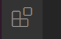
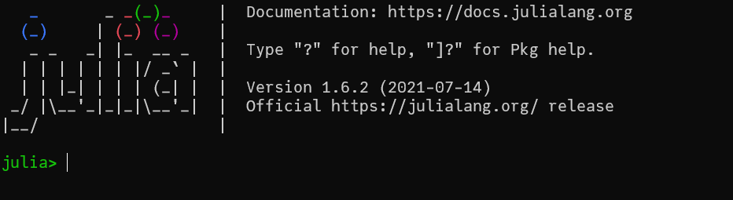
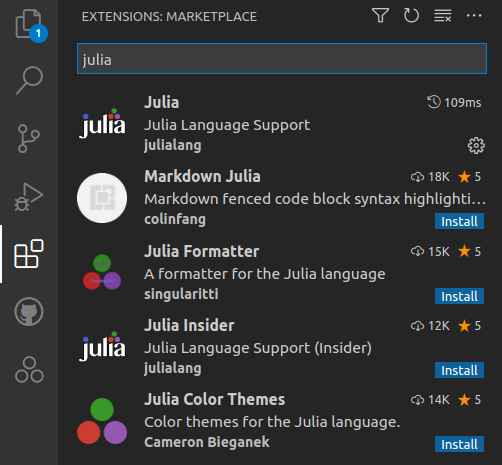
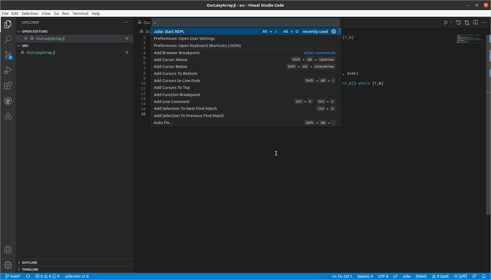
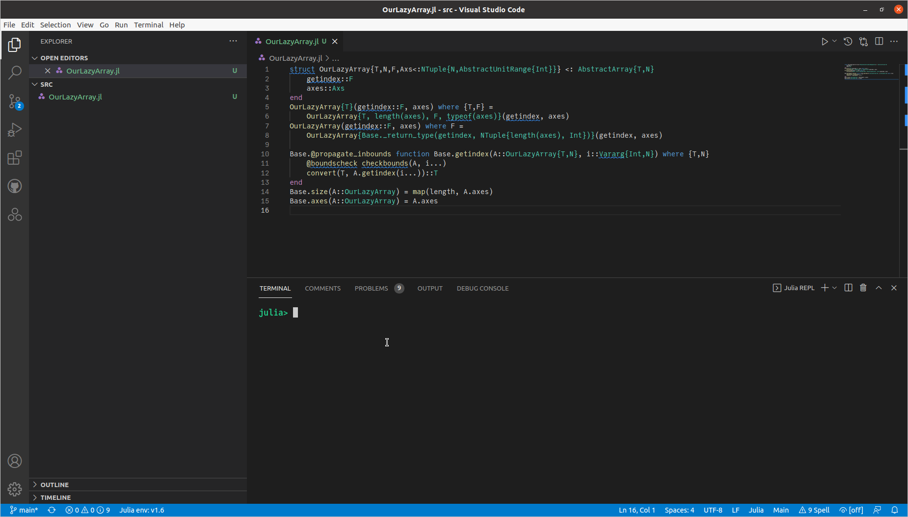

Your first task is to set up a development environment. Minimally, this includes Julia, VS Code, and its Julia extension, although the Julia-specific steps can be deferred until the second week.  Optionally, you might also be interested in Jupyter notebooks (the *Ju* is for Julia, the first language besides *py*thon to support notebooks), a good terminal & shell (for Windows users), and a standalone Git client.

The author is primarily a Linux user, and some advice for Windows and Macs may not be ideal; please provide feedback and help each other on the slack.

# Install VS Code and extensions

Visual Studio Code (VS Code) is a modern, cross-platform, cross-language development environment.  Install [VS Code from here](https://code.visualstudio.com/).

To install the extensions:

- launch VS Code

- click on the extension manager (in the vertical bar at the left):
  

- type `GitHub` in the search bar and install the "GitHub Pull Requests and Issues" extension

- type `git` in the search bar and install the "Git History" extension

If you are not already familiar with VS Code, you should spend some time reading the documentation (see the "Docs" in the banner at the top of the VS Code page), particularly the [user interface](https://code.visualstudio.com/docs/getstarted/userinterface).  If you prefer [videos](https://code.visualstudio.com/docs/getstarted/introvideos), the first two ("Getting Started" and "Code Editing") would be the minimum needed to start.

# Optional tools

Some people like Jupyter (the lectures will be delivered in Jupyter, using the [RISE](https://rise.readthedocs.io/en/stable/index.html) extension).

Once you start using Git, you may find that VS Code's built-in Git extension is not quite everything you need.  One popular tool it [GitKraken](https://www.gitkraken.com/).

*You can safely wait until the course turns to Julia, starting with the second session, before taking any more steps.*

# Install Julia

First, you'll need your own copy of Julia:

- visit [JuliaLang](https://julialang.org/) and click the Download button (note also the Documentation button and banner links to "Learn" and "Community"; you may visit these later)
- install the *current stable release* for your platform (you almost certainly want the 64-bit version; on Windows, use the "installer" version). Daring users could alternatively or additionally try the 1.9.0-beta release; while I wouldn't normally recommend a beta, 1.9 has some nice features, for example significantly reduced compiler latency (sometimes called "time to first plot"). Until you discover this to be an annoyance, most likely you should use the current stable release.

Check your installation by launching Julia, either by double-clicking the application, or launching it by typing `julia` in a shell.  For the latter to work you may need to [adjust your `PATH` variable](https://julialang.org/downloads/platform/).  You should see something like this:



## Windows-specific issues and WSL

- [old versions of PowerShell can cause problems](https://discourse.julialang.org/t/antivirus-hit-during-package-install/48706). Recommended solution: run PowerShell 7.
- [antivirus can cause very slow Pkg operations](https://discourse.julialang.org/t/status-of-pkg-speed-improvements-outside-us-in-v1-5/46395/7). Hopefully this won't affect you; if it does, try adding an exclusion for `*.toml` files.  You can also temporarily disable antivirus during package updates. Finally, if you get really annoyed by this, one good option is to [install Windows Subsystem for Linux (WSL)](https://learn.microsoft.com/en-us/windows/wsl/install) and run Julia (and maybe other programming tasks...) under Linux.  As a long-time Linux user who has recently migrated to a Windows desktop, I am quite impressed with WSL and use it for the vast majority of my Julia development. If you install WSL, be sure to also install [Windows Terminal](https://learn.microsoft.com/en-us/windows/terminal/install) or some of Julia's nice Unicode fonts won't display properly.

## Other interventions (may apply to Windows too)

- *setting your editor*: Julia has a nice feature, `@edit somefunction(args...)`, that lets you open the source code file for the method that would carry out the given operation. On some platforms, Julia doesn't easily know the path for your editor or know which one you prefer. You can [create at startup.jl file](https://docs.julialang.org/en/v1/manual/environment-variables/) for configuring your Julia sessions, and then add configuration commands. For example, [to set your editor](https://discourse.julialang.org/t/edit-on-windows/1695) you can define

```julia
ENV["JULIA_EDITOR"] = '"' * raw"..." * '"'`
```

where you replace "..." with the path to your editor. For example, this might be something like `C:\Program Files\Microsoft VS Code\Code.exe` on Windows or `/usr/bin/code` on Linux.

 The "raw" in front of the string means a "raw string" that gets taken literally; that's especially handy on Windows where the path separator `\` may otherwise be interpreted as an [escape sequence](https://docs.microsoft.com/en-us/cpp/c-language/escape-sequences?view=msvc-160).

# Julia and VS Code

You should install the Julia extension in VS Code:
type `julia` in the search bar and install the first hit, `Julia: Julia Language Support`:
. The process is described in greater detail on the official [Julia in Visual Studio Code](https://code.visualstudio.com/docs/languages/julia) page. If you've chosen the Julia 1.9-beta, you may need to click "Switch to pre-release version" on the extension banner page.

Even if you are familiar with VS Code itself, read the [Julia extension documentation](https://code.visualstudio.com/docs/languages/julia).  More information can be found at the [project site](https://www.julia-vscode.org/).

Finally, perhaps the best way to interact with Julia in VS Code is via the [Command Palette](https://code.visualstudio.com/docs/getstarted/userinterface#_command-palette):

- hit Ctrl-Shift-P in the session:
  

- search for Julia and select it (once you start using it, it will be first and you just hit "Enter"); you should see a Julia [REPL](https://en.wikipedia.org/wiki/Read%E2%80%93eval%E2%80%93print_loop) start:

  

This will open a Julia REPL. You can quit this REPL with `exit()` or hitting Ctrl-D.

Despite the convenience and advantages of running Julia inside VS Code, I still find myself using the external terminal.  If you are on Windows and decide you want to try an external terminal, don't live with the built-in primitive `cmd` terminal; see above about "Windows Terminal."
